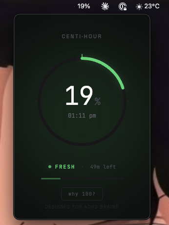

# Centi·Hour

**A macOS menubar app that shows the current hour as a percentage (0–100%).**

Your brain thinks in percentages, not sixths. When a clock says `:30`, it doesn't *feel* like half. But `50%` does. Centi·Hour translates time into a language your mind already speaks.



## Why?

ADHD brains (and many others) struggle with base-60 time. Minutes don't map to intuitive proportional thinking. Centi·Hour replaces `:00`–`:59` with `0%`–`100%`, giving you an instant feel for where you are in the hour.

- **0–25% (fresh)** — the hour just started, green
- **25–50% (flowing)** — quarter gone, yellow
- **50–75% (ticking)** — past the halfway mark, orange
- **75–100% (closing)** — the hour is almost up, red

A subtle flash at each quarter boundary (25%, 50%, 75%, 0%) keeps you anchored without being annoying.

## Features

- Lives in the macOS menubar — shows `63%` as text, no distracting icon
- Click to open a floating dark panel with a circular progress ring
- Color-coded phases (green → yellow → orange → red)
- Real clock time displayed as secondary info
- Minutes remaining in the hour
- "Why 100?" explainer toggle
- Right-click for context menu with "Launch at Login" option
- Lightweight — no background resource drain

## Tech Stack

- [Electron](https://www.electronjs.org/) + [menubar](https://github.com/nicktaf/menubar)
- Vanilla HTML/CSS/JS renderer (no framework overhead)
- Fonts: JetBrains Mono + Space Grotesk (loaded from Google Fonts)

## Install

### Download (no coding required)

1. Go to [Releases](https://github.com/BipinRimal314/centi-hour/releases)
2. Download the `.dmg` for your Mac:
   - **Apple Silicon** (M1/M2/M3/M4): `Centi·Hour-*-arm64.dmg`
   - **Intel**: `Centi·Hour-*-x64.dmg`
3. Open the `.dmg`, drag Centi·Hour to Applications
4. Launch from Applications — macOS will block it the first time since it's unsigned
5. Go to **System Settings → Privacy & Security**, scroll down, click **"Open Anyway"**
6. Right-click the percentage in your menubar → check **"Launch at Login"**

### Build from Source

Requires Node.js 18+ and npm.

```bash
git clone https://github.com/BipinRimal314/centi-hour.git
cd centi-hour
npm install
npm start          # run in dev mode
npm run build      # build .dmg for Apple Silicon
npm run build:intel    # build .dmg for Intel Macs
npm run build:universal # build .dmg that works on both
```

Outputs go to `dist/`.

## File Structure

```
centi-hour/
├── package.json      # Dependencies & electron-builder config
├── main.js           # Electron main process + menubar setup
├── index.html        # Panel HTML
├── renderer.js       # Timer logic & DOM updates (vanilla JS)
├── styles.css        # All styles & animations
├── icon.png          # Menubar icon placeholder
├── LICENSE           # MIT
└── README.md
```

## Design

Designed by [Bipin Rimal](https://bipinrimal.com.np). Dark theme only — looks great as a floating panel in both light and dark macOS modes.

Typography uses JetBrains Mono for the percentage display and Space Grotesk for labels. The circular progress ring features smooth CSS transitions, ambient glow effects, and decorative tick marks at quarter boundaries.

## License

[MIT](LICENSE)
